# ✅ 專案目的
本專案旨在建立一套線上購物平台，使用者可以瀏覽商品、加入購物車、進行結帳與付款，管理員則可管理商品、訂單、用戶與報表。 

# 透過本專案學習與實作：
1.Java Web 應用開發流程 
2.前後端資料互動 (JSP + jQuery + AJAX + Servlet + Restful API + Hibernate) 
3.DAO 資料存取設計模式 
4.MySQL 資料庫設計與整合 
5.MVC 架構與分層設計 
6.圖片與靜態資源的管理與顯示 
7.多角色權限控管（使用者 / 管理員） 

# 🧱 系統架構與分層
📦 src.main 
 ┣ 📁 java 
 ┃ ┣ 📁 controller     → 控制層（接收前端請求，呼叫 service） 
 ┃ ┣ 📁 model       → 資料模型（對應資料表） 
 ┃ ┣ 📁 dao         → 資料存取層（CRUD） 
 ┃ ┣ 📁 service     → 商業邏輯處理層（資料驗證、查詢） 
 ┃ ┗ 📁 META-INF    → JPA 設定檔（如 persistence.xml） 
 ┗ 📁 webapp 
   ┣ 📄 *.jsp        → 頁面 UI 顯示（含前後台介面） 
   ┣ 📁 css/js       → 靜態資源（樣式與前端邏輯） 
   ┗ 📁 images_*     → 商品圖片、網站 LOGO、輪播圖等 

📦 target/ → Maven 編譯與打包後的 class 與資源 

# 🧑‍💻 功能模組設計 - 🛍 一般使用者 
商品瀏覽（首頁、分類） 
商品搜尋 
加入 / 移除購物車 
購物車頁面更新數量 
結帳流程（選擇配送、付款方式） 
訂單查詢 
使用者註冊 / 登入 / 登出 / 修改資料 

# 🧑‍💻 功能模組設計 - 🛠 管理者功能 
商品管理（新增 / 編輯 / 刪除） 
訂單管理（查詢詳細、更新狀態） 
使用者管理（檢視 / 停權） 
員工帳號管理 
圖表報表統計（adminreport.jsp 使用 jQuery + 圓餅圖 / 柱狀圖） 

# 🗃 資料庫設計（MySQL） 
user：使用者帳號資料 
product：商品資訊 
cart：購物車（暫存） 
order：訂單資料 
order_item：訂單明細 
payment：付款資訊 
shipping：配送資料 
employee：後台管理帳號 

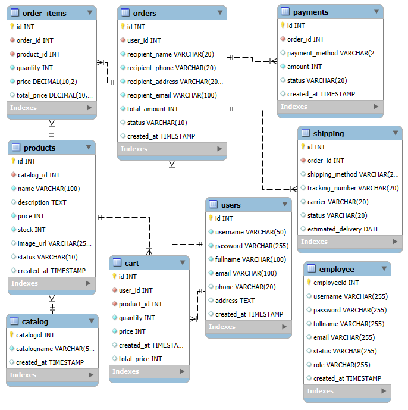

# 🔧 使用技術與工具 

# 程式流程設計 （Java Web 購物網站） 
🗂 系統分層架構（MVC + DAO ) 
Controller(Servlet/Restful API⇄ Service ⇄ DAO ⇄ MySQL資料庫 
        ⇅ 
      JSP（前端頁面） 

🌐 使用者操作流程圖（前台） 
1. 使用者訪問 index.jsp（首頁） 
          ↓ 
2. 點擊登入 → login.jsp 
          ↓ 
3. 輸入帳密 → UserLogin.java 
          ↓ 
4. 登入成功 → 進入 main.jsp（或導向 profile.jsp） 
          ↓ 
5. 瀏覽商品（shopX.jsp → ShopList.java） 
          ↓ 
6. 加入購物車（ShopAdd.java） 
          ↓ 
7. 查看購物車（cart.jsp） 
          ↓ 
8. 修改/刪除商品（CartUpdate.java / CartDelete.java） 
          ↓ 
9. 結帳 → CheckoutServlet.java 
          ↓
10. 輸入付款資料 → PaymentServlet.java 
          ↓
11. 訂單完成 → order.jsp + orderdetail.jsp 

# 🔒 管理員操作流程（後台） 
1. 管理員登入 → adminlogin.jsp → UserLogin.java 
          ↓
2. 進入 adminportal.jsp（後台首頁） 
          ↓
3. 管理員功能頁面： 
   ├─ adminemployee.jsp（員工管理） 
   ├─ adminuser.jsp（使用者管理） 
   ├─ adminproduct.jsp（商品管理） 
   ├─ adminorder.jsp（訂單管理） 
   ├─ adminreport.jsp（報表視覺化） 
   ├─ adminprofile.jsp（個人資料） 

# 📖 使用手冊
## 1.匯入 MySQL Schema 和 Table

請下載 SQL 目錄的檔案，並按照以下步驟將其匯入 MySQL：

打開 MySQL Workbench。

連接到 MySQL 伺服器。

在左側資料庫樹狀中，選擇要匯入資料的資料庫。

在 MySQL Workbench 上方的「管理」標籤下，選擇 資料匯入。

選擇要匯入的檔案（例如 shoppingmall 開頭的.sql）。

點擊 開始匯入。

匯入完成後，資料庫中的 Schema 和表格應已成功設置。

## 2.準備好 Tomcat 9.0 可執行環境

下載 shoppingmall.war , 並置於適當位置  

# 🖥️ 使用介面介紹-前台
## 🏠前台主頁

## 🛍️ 前台-產品分類

## 👤前台主頁-登入

## 📝前台主頁-註冊

## 🛒前台主頁-購物 (範例)

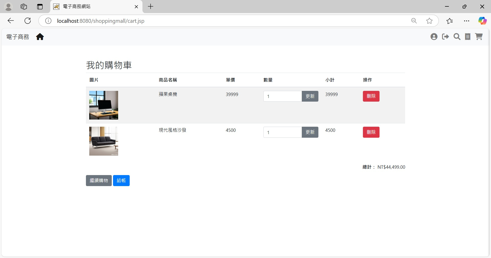

## 📦前台主頁-訂單管理

## 🏠後台主頁
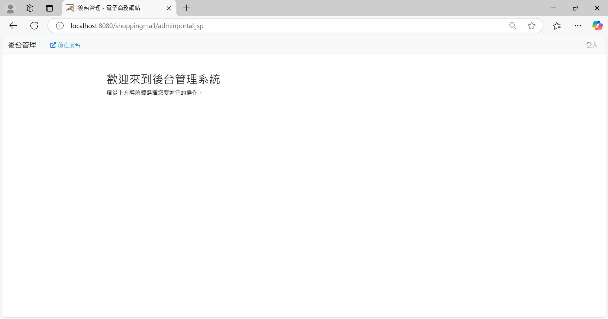

## 👤後台主頁-登入
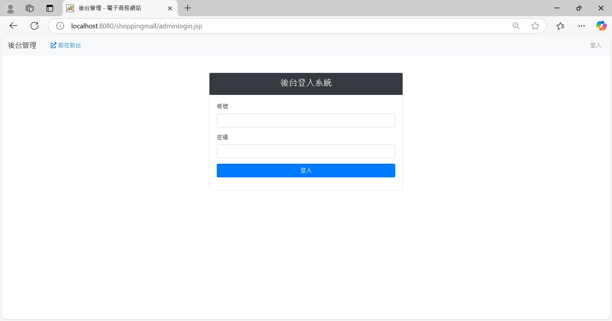
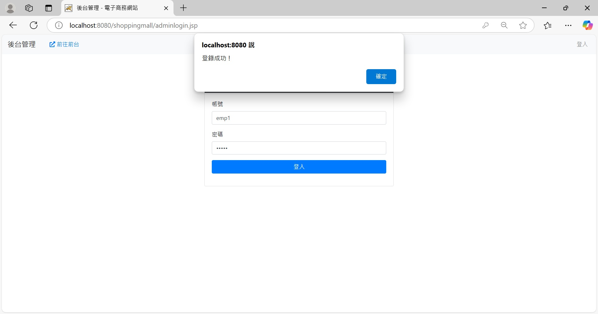
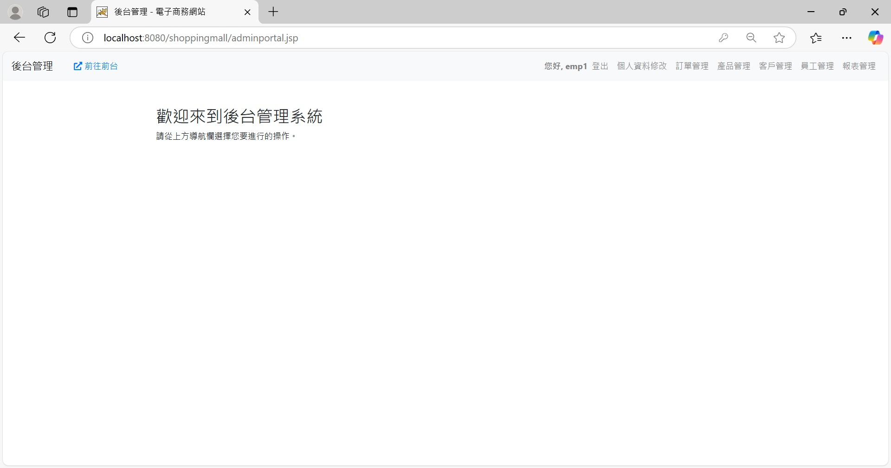

## 📦後台主頁-訂單管理
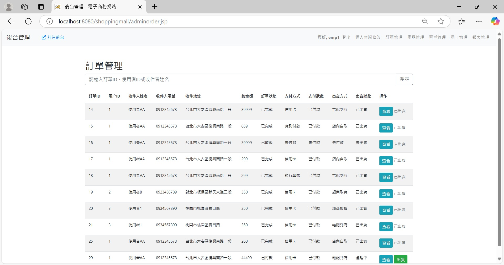

## 📦後台主頁-訂單管理-搜尋
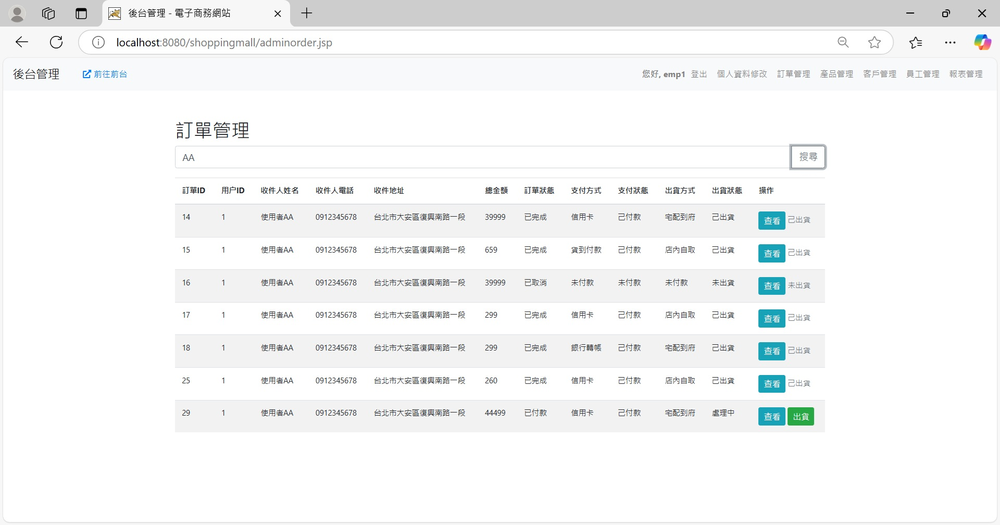

## 👤後台主頁-使用者管理
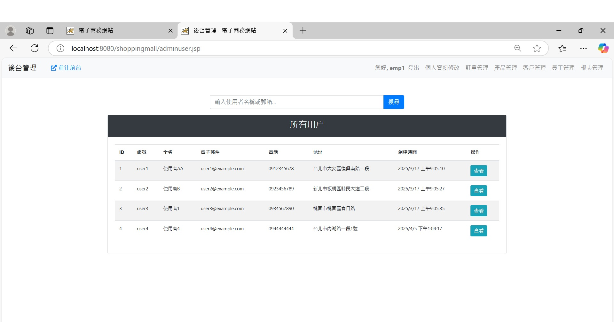

## 🖼後台主頁-產品管理
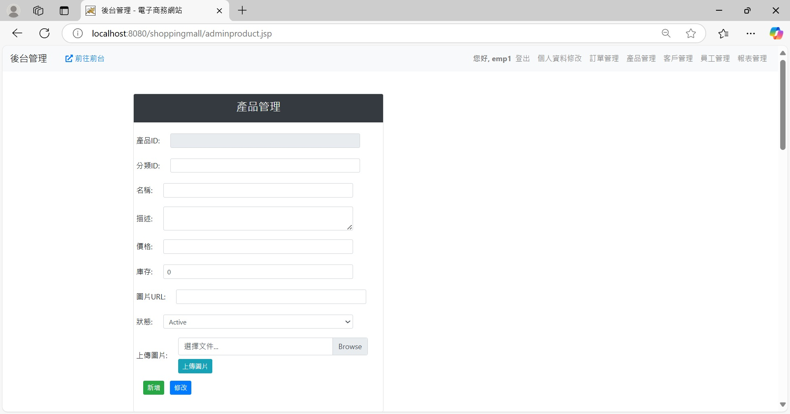
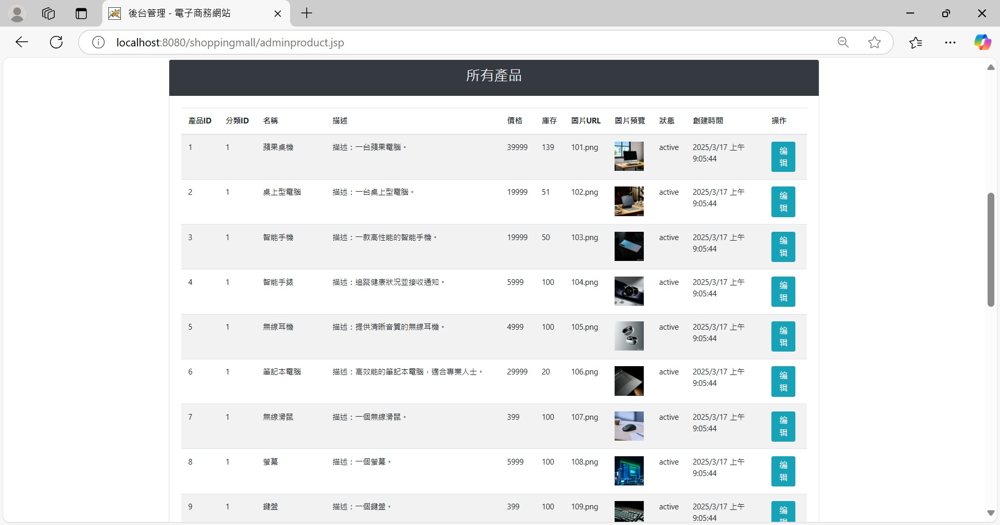

## 👤後台主頁-客戶管理

## 後台主頁-報表管理
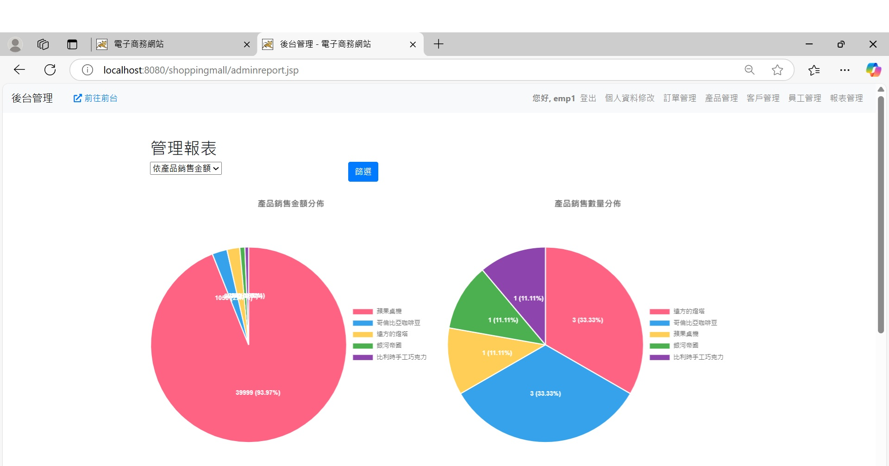
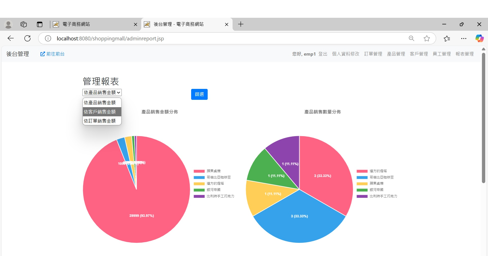

# 以上是專案說明

